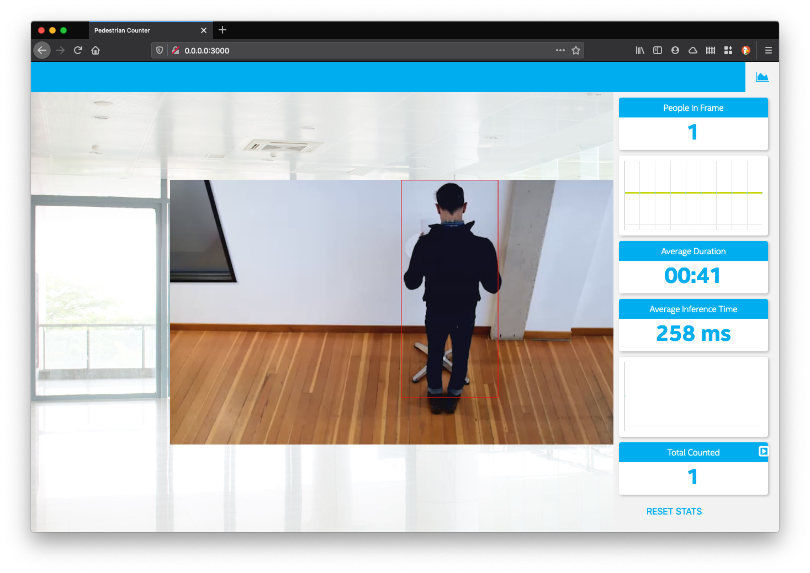

# Deploy a People Counter App at the Edge

This repo contains the first project of the Intel® Edge AI for IoT Developers Nanodegree Program. 

The project is about implementing a python application using [OpenVino Toolkit](https://software.intel.com/content/www/us/en/develop/tools/openvino-toolkit.html), MQTT and FFMPEG.

You could find the complete and official WRITE-UP of the project [here](./nd131-openvino-fundamentals-project-starter/WRITEUP.md)

