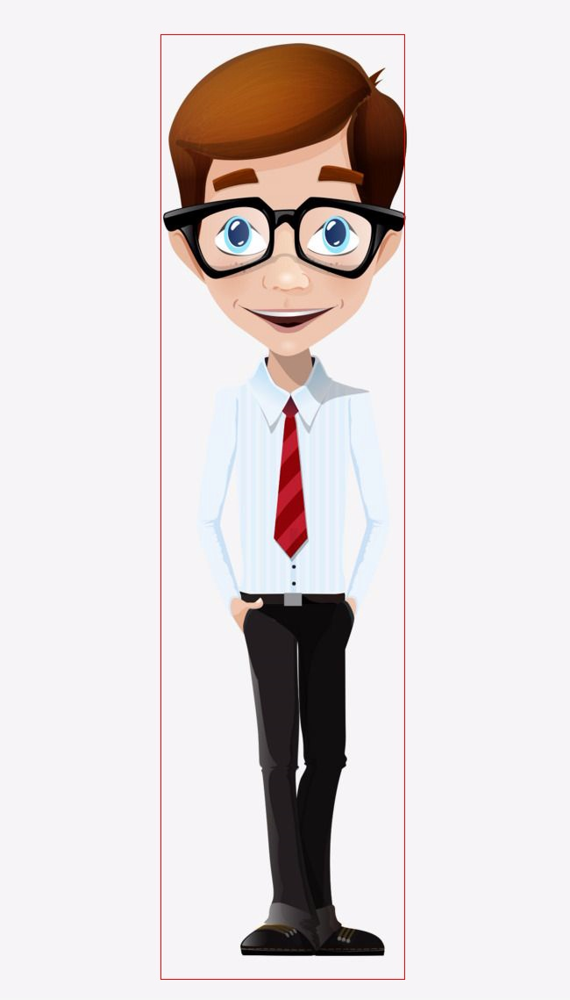
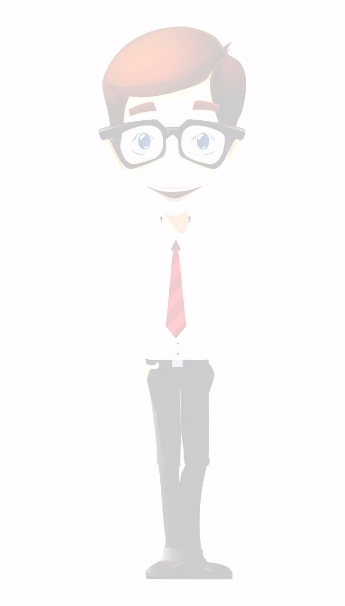
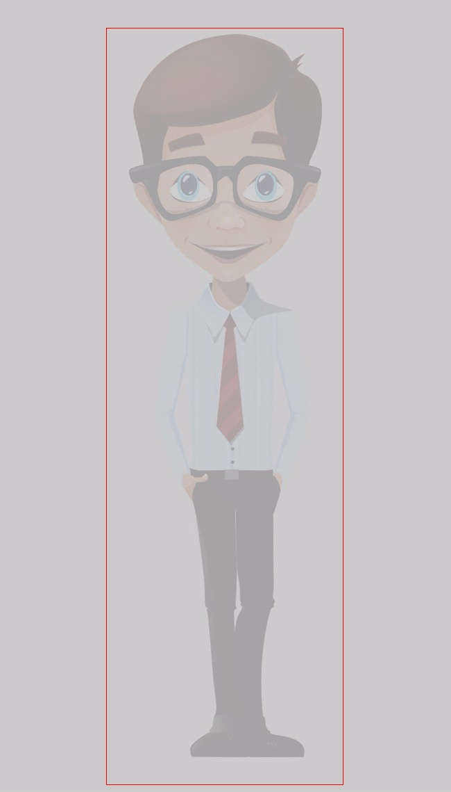
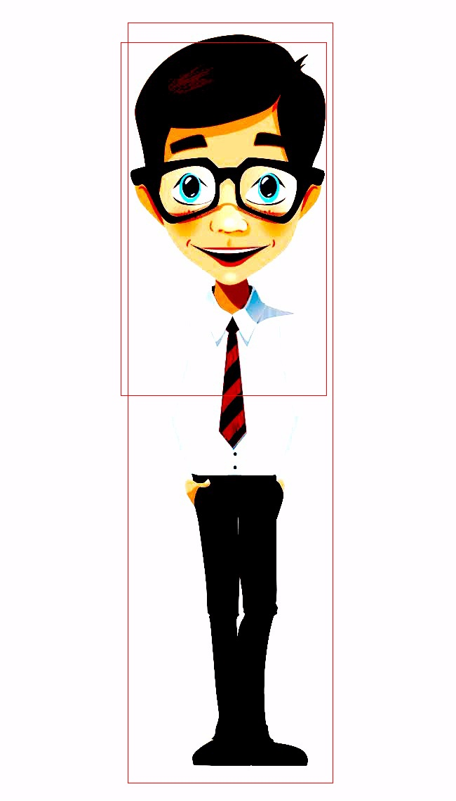
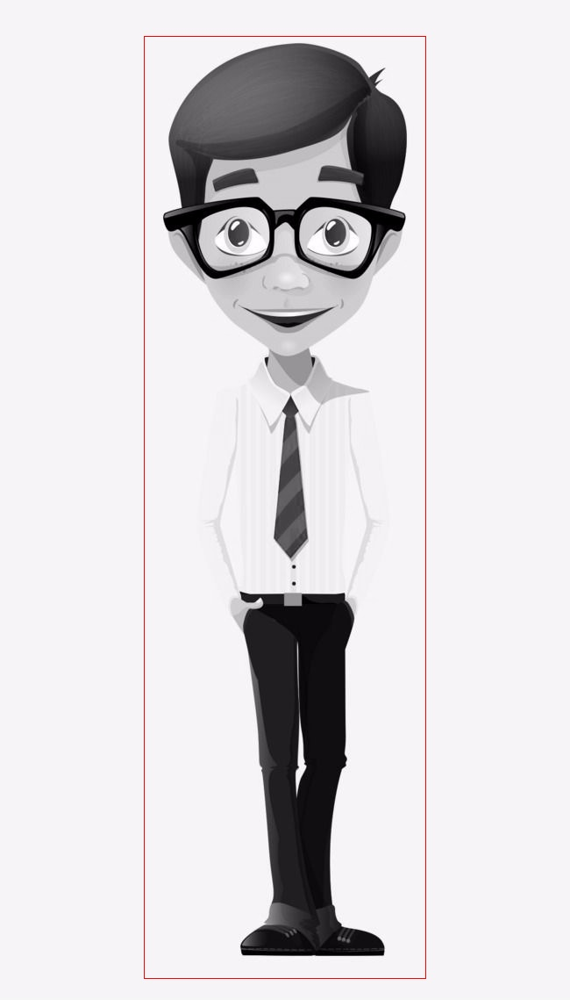

# Images Test with Final IR

## Original Image

## Brightness
An image with too much brightness make the inference fails.  

## Contrast
In this case, in spite of the contrast reduction, the inference work well.
  
But if we increased the contrast I obtain this result:

This is a curious case, because due to the original image characteristics the model inference output is like there are two person.

## Blur
If we apply a blur over the original image, the model is able to detect the person, probably because in spite of the fact that the image is clearly unfocussed, the shape of the person is still there.

## Saturation

## Size

## Conclusion
This is a small test but we can observe that brightness and contrast could affect to the inference. So for a good inference we should have a good light and contrast, if we want to obtain good results in our application we should put focus on the quality of the images.