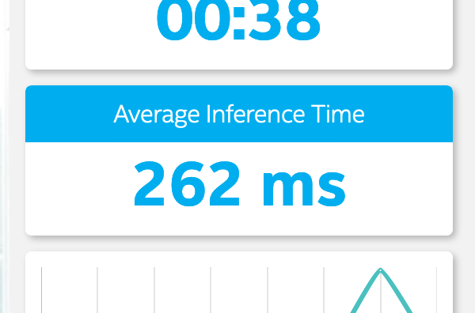

# Project Write-Up
**Author**: Héctor Abraham Morillo Prieto

## Explaining Custom Layers

Custom layers are the way to thread with non directly supported layers in OpenVino from the original model. We could find custom layers through the Model Optimizer (layers that are not directly supported) and in execution time with the inference engine (depending on the hardware that we are using).

### Custom Layers on the Model Optimizer
When we are using the model optimizer over a model with non supported layers, any of this layers will automatically classified as a custom layer. 
Depending on the model framework we have difference ways of handle the custom layer, some of them are common to all frameworks, for example:
- Register an extension on the Model Optimizer
- Register the layer as custom and execute on the original model. This method imply that we need to have installed and ready the original framework in our system

Each framework could have other ways to handle with non supported layers, for example, Tensorflow allows to replace the unsupported subgraph with other subgraph.

### Non supported layer on a concrete hardware
When we are going to execute the Inference Engine with an Intermediate Representation we should verify in execution time if the hardware supports all the layers. Sometimes, our hardware couldn't manage some layer and we have to handle it. 

For example some layer are not supported in CPU's so we should use extensions for the Inference Engine in order to allow the execution of this model in that hardware. OpenVino toolkit provide us some extension for this kind of issues.

## Comparing Model Performance

In this project I try to select different pre-trained models in order to practice with the Model Optimizer and several machine learning frameworks. Some of the pre-trained models that I try to use gave me successfully results but others I would need more time to achieve better results.

You could find the models list with the link and the model Optimizer command [here](./WRITEUP-models.md)

As you could see on the list, I try to use different frameworks, image-sets and networks.

### Size Comparison

| Model                                            | Original Size  | IR Size      |
|:---:                                             |:---:           |:---:         |
| TF - SSD Mobilenet v2 COCO (2018_03_29)          | 69,7 mb        | 67,3 mb      |
| TF - SSD Inception v2 COCO (2018_01_28)          | 102 mb         | 100,1 mb     |
| CAFFE - COCO SSD512                              | 144,2 mb       | 144,2 mb     |
| CAFFE - COCO SSD300                              | 137,2 mb       | 137,2 mb     |
| CAFFE - VOC SSD300                               | 105,2 mb       | 105,1 mb     |
| TF - SSD Mobilenet v1 FPN COCO (2018_07_03)\*    | **51,3 mb**    | **123,7 mb** |
| TF - Faster RCNN Resnet101 Kitti (2018_01_28)\*\*| 189,4 mb       | 188,9 mb**   |
| TF - Faster RCNN Resnet101 COCO (2018_01_28)\*\* | 196,5 mb       | 192,5 mb**   |

**\*Note:** In almost every case I tested the original size is very similar than their Inference Representation after used the Model Optimizer. There is only one striking case the *TF - SSD Mobilenet v1 FPN COCO (2018_07_03)* where the difference between sizes is more than **72 mb**. I don't have a clear explanation for that so I may investigate more.  
**\*\*Note:** It was successfully converted but I couldn't make real inferences with it

**Problems:** I tried to optimize some MXNET / Gluon models but I didn't achieve it. You could see more detail in [used models file](./WRITEUP-models.md).  

### Accuracy 

As we discuss in some of the issues on the knowledge page in Udacity, I assume that the accuracy pre- and post-conversion is the same.

I didn't make a deep analysis about the accuracy of the used models, but based on the retrieved outputs (we don't have to take it as serious experiment):

| Model                                            | Subjective Accuracy |
|:---:                                             |:---:                |
| TF - SSD Mobilenet v2 COCO (2018_03_29)          | BAD                 |
| TF - SSD Inception v2 COCO (2018_01_28)          | BAD                 |
| CAFFE - COCO SSD512                              | GOOD                |
| CAFFE - COCO SSD300                              | GOOD                |
| CAFFE - VOC SSD300                               | GOOD                |
| TF - SSD Mobilenet v1 FPN COCO (2018_07_03)      | VERY BAD            |

### Inference time

We use the script `tensorflow-executor.py` included in this project. It accepts as input a TensorFlow Model and an video or image input and calculate de average inference time with all frames.

| Model                                            | IE Inference Time | Pre-conversion Time      |
|:---:                                             |:---:              |:---:                     |
| TF - SSD Mobilenet v2 COCO (2018_03_29)          | 32 ms             | 60 ms                    |
| TF - SSD Inception v2 COCO (2018_01_28)          | 54 ms             | 81 ms                    |
| CAFFE - COCO SSD512                              | 733 ms            | -                        |
| CAFFE - COCO SSD300                              | 256 ms            | -                        |
| CAFFE - VOC SSD300                               | 248 ms            | -                        |
| TF - SSD Mobilenet v1 FPN COCO (2018_07_03)      | 477 ms            | 603 ms                   |

For pre-conversion time I only analyze TensorFlow models but we could notice a significant improvement in the inference time. 

## Assess Model Use Cases

### Marketing Stands / Shop showcases
A good potential use case could in marketing stands or shop showcases. We could determine how many people stops in front of the marketing action and how much time they spend looking the advertisement. This data could be very useful if we are able to cross data with other information like the gender, the age, the location of the advertisement a any other data depending of what information are we looking for. 

For example we can test several marketing campaigns for one product (like an A/B test) and determinate which is more effectively and between what kind of person (young people, parents, etc). 

Maybe we could go further, and if we are in a fair a we could localize the person who is interested in our product (we can analyze the time they was looking our showcase), we can send some kind of promotion to them in order to encourage them to buy or get more information about the product.

Other possibility in the marketing field, if we are capable of re-identify a person a know how many times they come to see the showcase, we could make some kind of action that they could see to encourage to purchase our product or service.

### Prevention of occupational hazards with heavy machine
Some times heavy machine is difficult to manage due to their size, they are big machines and is difficult for the drive be sure that if he realize some movement or actions nobody will be at risk. 

If we install cameras on this kind of heavy machines we could react with several actions if we detect the presence of a person. In fact, we could implement difference actions if the person just enter in the action radius of the machine, like an alarm, or block the machine if the spend more than a determinate number of seconds inside the danger zone.

### Improvement traffic lights management
The management of the traffic lights in a city is to difficult and it contribute to the global warming when we force to stop the traffic if nobody want's to cross the street. 

We could use or pedestrian detector in order to determinate when someone is waiting for crossing the street a use this information to regulate the traffic lights. With this approach, in the hour that there are less pedestrians in the street we avoid to stop the cars if it's not needed.

## New Features
In order the improve the project and make easy some test and play with it I developed some new features. In this section I'm try to explain each one.

### Inputs
As the project require, I implement the possibility of use three differences inputs:
- **IMAGE**: User could use the app with just a simple image. With this kind of input the application will generate an output image with the inference.
- **VIDEO**: If we use a video as input, each frame of the stream will be analyze and send the inference output image and the stats through the MQTT and FFMPEG servers. 
- **CAMERA**: In order to make more realistic the application as if it is executed at the edge, I implemented the option of use the device camera as input stream. The output is completely the same as in the video option.

Application is capable of determine for itself if the input file is an image or a video, so the user don't need to be worried about that.

### Image Set
In order to allow several image-set I added a new argument for the application. The `-is / --image_set` argument allow the user specify which image set was used to train the model. With this information the application know how to deal with the inference output to extract if the model identifies a person in the frame.  
>Specify the image-set used, we will use this to determinate what value indentify a person in the output. Ex: COCO = 1, PASCAL_VOC = 15"

### Log File
As we use the standard output to share with FFMPEG server the output image, we can't print any other log trace or message because it will corrupt the image stream. For that reason I implement a log output system using `logging`. This allow to print any message that we need for develop purpose.

If the user don't specify the parameter a new file will be created by default. If they prefer to choose the output file they could add the argument `-lf / --log_file`.

### Tolerance frames
Sometimes the model could fail with their inference and I we don't do anything it will produce several errors in the counter and in the stats. For that reason I add a new control parameter that the user could control with the argument `-tf / --tolerance_frames`.

The app will use this parameter as the minimum value of frames that the inference engine has to not detect the presence of the pedestrian to finally accept that a pedestrian has disappear and increase the counter.

This value will improve the accuracy of the complete solution.

### Average inference time
I modified the UI of the application to show the average inference time. For this purpose I have to send a new topic through MQTT and adapt the UI to receive this value and calculate the average value with all the single values.

The UI was modified in the stats apart as you can see in the following image:

### Execute script
I've created a small script `execute.sh` in order to save all the execution command I'd used.

### Reset Stats
In order to make easy the reset of stats, I add a new button on the stats zone. Just click on the button initialize all the stats.

## Assess Effects on End User Needs

You could see a detailed test with some modifications over the same image in [images test](./WRITEUP-imagestest.md).  

## Conclusion

After retrieve the previous data about accuracy and average inference time I decided to used the `CAFFE - VOC SSD300` model. This model is a bit slow when I execute it in my CPU but, probably, if we execute it in a GPU or other device more adapted to this kind of task the performance will be much better.  

With this model I achieve to get counted just the real value of persons that appears in the video. 

I used a probability threshold of 0.3 with 24 frames of tolerance (1s on the video).  

The command is:  
`python nd131-openvino-fundamentals-project-starter/main.py -i nd131-openvino-fundamentals-project-starter/resources/Pedestrian_Detect_2_1_1.mp4 -m  IR/VGG_VOC0712Plus_SSD_300x300_ft_iter_160000/VGG_VOC0712Plus_SSD_300x300_ft_iter_160000.xml -d CPU -pt 0.3 -is PASCAL_VOC -tf 24 | ./ffmpeg -v warning -f rawvideo -pixel_format bgr24 -video_size 768x432 -framerate 24 -i - http://0.0.0.0:3004/fac.ffm`

Maybe the probability threshold is too low and one of the possible objective would be to improve the model or find another technique that helps the tolerance frames in order to reduce the frames where the person is not detected.

**Note**:*It's important to take into account that the tolerance frames could produce errors too if difference persons go out and go into the scene to quickly.*

I've played with this values for seeing how they affect to the inference and the results. For example, if I increase the probability threshold to 0.4, I get 7 person counted when the real value is 6. Who makes our system more reliable (less false positives) and not decrease a lot the accuracy of the application.